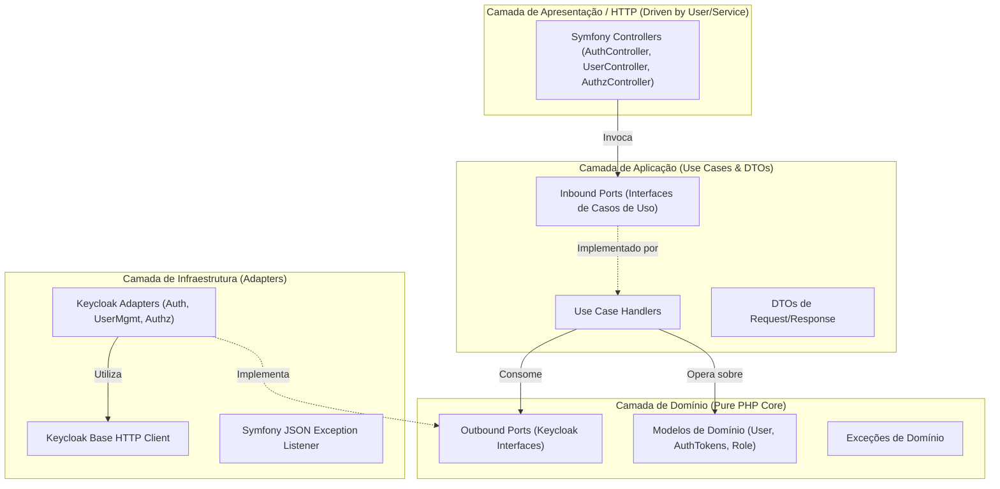

# Architecture Spine — OAuth & Keycloak Microservice

## Design Paradigm

O microserviço adota estritamente a **Arquitetura Hexagonal (Ports and Adapters)**.
O objetivo central é isolar o núcleo da aplicação (regras de negócio, autenticação e contratos de domínio) de qualquer acoplamento direto com o framework HTTP (Symfony) e com o provedor de identidade externo (Keycloak). 

### Camadas e Direção de Dependência



* **Regra de ouro das dependências:** As setas apontam sempre para dentro.
  * `Domain`: PHP 8.2+ puro, zero dependências externas ou de frameworks.
  * `Application`: Depende exclusivamente de `Domain`. Orquestra casos de uso e converte DTOs.
  * `Infrastructure`: Depende de `Domain` (para implementar as *Outbound Ports*) e `Application`. Contém o código que fala com a API REST do Keycloak e bibliotecas Symfony.
  * `UI / Controller`: Depende de `Application` (para invocar as *Inbound Ports*). Converte HTTP Request em DTO e retorna JSON Response.

---

## Invariants & Rules

### AD-1 — Isolamento da Camada de Domínio e Inversão de Dependência [ADOPTED]
- **Binds:** Todo o código em `src/Domain` e `src/Application`.
- **Prevents:** Acoplamento a SDKs ou rotas específicas do Keycloak no coração do sistema.
- **Rule:** O Domínio nunca referencia namespaces do Symfony, Guzzle ou Keycloak. Toda comunicação externa ocorre através das interfaces declaradas em `src/Domain/Port/Outbound/`.

### AD-2 — Autenticação de Serviço na Keycloak Admin API via Client Credentials [ADOPTED]
- **Binds:** Operações de gestão de usuários (`POST /users`, `GET /users`, `PUT /users`, etc.).
- **Prevents:** Falhas de autorização na Admin API ou dependência de credenciais administrativas enviadas pelo usuário final.
- **Rule:** O adaptador de infraestrutura `KeycloakHttpClient` obtém e renova automaticamente um token administrativo via fluxo *OAuth 2.0 Client Credentials* usando o `client_id` e `client_secret` do cliente `oauth` (com role de serviço `manage-users`). Esse token é retido em memória com base no `expires_in` e utilizado exclusivamente para as rotas `/admin/realms/{realm}/...`.

### AD-3 — Provisionamento Automatizado do Keycloak via Docker Import [ADOPTED]
- **Binds:** Ambiente de desenvolvimento Docker.
- **Prevents:** Necessidade de configuração manual via console web do Keycloak por cada um dos 4 integrantes do time, eliminando erros de setup e inconsistências.
- **Rule:** O arquivo `docker/keycloak/realm-export.json` contém todo o estado inicial do realm `constrsw` (client `oauth`, roles, resources, policies e permissions). O container do Keycloak é configurado para importar este arquivo na inicialização (`--import-realm`).

### AD-4 — Contratos de Portas e DTOs Pré-fixados na Base Compartilhada [ADOPTED]
- **Binds:** As 4 frentes de trabalho do time.
- **Prevents:** Conflitos de merge e incompatibilidade de tipos quando as 3 branches de features forem integradas na branch principal.
- **Rule:** As interfaces de portas em `Domain/Port/` e os DTOs em `Application/DTO/` são criados e commitados na branch base (`grupo01`) antes da abertura das branches dos integrantes. As branches de feature **não devem alterar** as assinaturas desses métodos.

### AD-5 — Protocolo de Avaliação de Políticas de Acesso (`POST /authorize`) [ADOPTED]
- **Binds:** FR-10 e integração de autorização.
- **Prevents:** Lógica dispersa de autorização entre microserviços.
- **Rule:** O endpoint `POST /authorize` espera o header `Authorization: Bearer <token>` e payload JSON `{"resource": "<nome_do_recurso>"}`. O adaptador avalia os papéis contidos no token contra a matriz oficial:
  * `administrator`: `resources`, `rooms`, `professors`, `students`.
  * `coordinator`: `courses`, `classes`.
  * `professor`: `lessons`, `reservations`.
  Retorna HTTP 200 (OK) se autorizado, HTTP 403 (Forbidden) se negado, e HTTP 401 (Unauthorized) se o token for inválido/expirado.

### AD-6 — Envelope Padronizado de Respostas de Erro [ADOPTED]
- **Binds:** Todos os endpoints e controllers HTTP.
- **Prevents:** Retornos em HTML cru, stack traces em produção ou formatos divergentes entre controllers implementados por diferentes alunos.
- **Rule:** Qualquer erro no sistema (exceções de domínio ou falhas de validação) é interceptado por um `JsonExceptionListener` global e serializado no formato:
  ```json
  {
    "error": {
      "code": "ERROR_CODE_STRING",
      "message": "Mensagem compreensível",
      "details": []
    }
  }
  ```

---

## Consistency Conventions

| Preocupação | Convenção |
| :--- | :--- |
| **Padrão de Nomenclatura** | Classes em `PascalCase`, métodos em `camelCase`, constantes em `UPPER_SNAKE_CASE`. Interfaces de porta com sufixo `PortInterface` (ex: `KeycloakAuthPortInterface`). DTOs com sufixo `DTO` (ex: `LoginRequestDTO`). |
| **Formato de Dados** | Entrada e saída padronizadas em `application/json` (com exceção do `POST /login`, que aceita adicionalmente `form-data`/`x-www-form-urlencoded` conforme requisito). |
| **Datas & Prazos** | ISO-8601 em strings (`Y-m-d\TH:i:sP`) ou inteiros em segundos para `expires_in`. |
| **Códigos HTTP** | Criação: `201 Created`. Exclusão Lógica: `204 No Content`. Busca/Listagem: `200 OK`. Não encontrado: `404 Not Found`. Credenciais/Token inválido: `401 Unauthorized`. Sem permissão: `403 Forbidden`. Conflito: `409 Conflict`. Validação: `400 Bad Request`. |
| **Exclusão de Usuário** | Exclusão estritamente lógica via Keycloak Admin API (`"enabled": false`). |

---

## Stack Tecnológica

| Componente | Versão Homologada | Função |
| :--- | :--- | :--- |
| **PHP** | `8.2+` (ou `8.3`) FPM | Linguagem principal da API backend |
| **Symfony** | `6.4 LTS` (ou `7.x`) | Framework base para roteamento, DI e HTTP Kernel |
| **Keycloak** | `quay.io/keycloak/keycloak:22.0+` ou `jboss/keycloak:latest` | Identity Provider (OAuth2 / OIDC / UMA Authorization) |
| **Web Server** | `nginx:alpine` | Proxy reverso e terminação HTTP na porta 8000 |
| **Composer** | `2.x` | Gerenciador de dependências PHP |
| **Container Engine** | `Docker` & `Docker Compose v2` | Orquestração do ambiente completo |

---

## Estrutura de Diretórios (Structural Seed)

```text
oauth/
├── docker/
│   ├── keycloak/
│   │   └── realm-export.json          # Provisionamento automático do Keycloak
│   ├── nginx/
│   │   └── default.conf               # Configuração do Nginx apontando para PHP-FPM
│   └── php/
│       └── Dockerfile                 # PHP 8.2 FPM + extensões necessárias
├── docker-compose.yml                 # Orquestração de App, Nginx e Keycloak
├── composer.json
├── config/
│   ├── packages/
│   ├── routes.yaml
│   └── services.yaml
├── public/
│   └── index.php
└── src/
    ├── Domain/                        # NÚCLEO PURO (SEM DEPENDÊNCIAS DE FRAMEWORK)
    │   ├── Model/
    │   │   ├── User.php
    │   │   ├── AuthTokens.php
    │   │   └── Role.php
    │   ├── Port/
    │   │   ├── Inbound/               # Interfaces de Use Cases (chamadas pelos Controllers)
    │   │   │   ├── LoginUseCaseInterface.php
    │   │   │   ├── RefreshTokenUseCaseInterface.php
    │   │   │   ├── GetUserInfoUseCaseInterface.php
    │   │   │   ├── CreateUserUseCaseInterface.php
    │   │   │   ├── ListUsersUseCaseInterface.php
    │   │   │   ├── GetUserByIdUseCaseInterface.php
    │   │   │   ├── UpdateUserUseCaseInterface.php
    │   │   │   ├── UpdatePasswordUseCaseInterface.php
    │   │   │   ├── DisableUserUseCaseInterface.php
    │   │   │   └── AuthorizeResourceUseCaseInterface.php
    │   │   └── Outbound/              # Interfaces de Infraestrutura (implementadas pelos Adapters)
    │   │       ├── KeycloakAuthPortInterface.php
    │   │       ├── KeycloakUserPortInterface.php
    │   │       └── KeycloakAuthorizationPortInterface.php
    │   └── Exception/
    │       ├── InvalidCredentialsException.php
    │       ├── UserNotFoundException.php
    │       ├── UserAlreadyExistsException.php
    │       ├── AccessDeniedException.php
    │       └── InvalidTokenException.php
    ├── Application/                   # CASOS DE USO E DTOs
    │   ├── DTO/
    │   │   ├── Auth/                  # LoginRequestDTO, TokenResponseDTO, RefreshTokenDTO
    │   │   ├── User/                  # CreateUserDTO, UserResponseDTO, UpdateUserDTO
    │   │   └── Authorization/         # AuthorizeRequestDTO, AuthorizeResponseDTO
    │   └── UseCase/
    │       ├── Auth/                  # [Frente 2] Login, Refresh, UserInfo
    │       ├── User/                  # [Frente 3] Create, List, Get, Update, Disable
    │       └── Authorization/         # [Frente 4] AuthorizeResource
    └── Infrastructure/                # ADAPTADORES CONCRETOS
        ├── Keycloak/
        │   ├── Client/
        │   │   └── KeycloakHttpClient.php   # Cliente HTTP centralizado e autenticado
        │   └── Adapter/
        │       ├── KeycloakAuthAdapter.php          # [Frente 2]
        │       ├── KeycloakUserAdapter.php          # [Frente 3]
        │       └── KeycloakAuthorizationAdapter.php # [Frente 4]
        └── Http/
            ├── Controller/
            │   ├── AuthController.php               # [Frente 2]
            │   ├── UserController.php               # [Frente 3]
            │   └── AuthorizationController.php      # [Frente 4]
            └── Listener/
                └── JsonExceptionListener.php        # Tratamento global de erros
```

---

## Mapeamento de Capacidades (Capability → Architecture Map)

| Requisito / Endpoint | Camada de Entrada (UI) | Caso de Uso (Application) | Adaptador (Infrastructure) | Frente / Responsável |
| :--- | :--- | :--- | :--- | :--- |
| **FR-1: POST /login** | `AuthController::login` | `LoginUseCase` | `KeycloakAuthAdapter` | Frente 2 (`grupo01/feat/auth-tokens`) |
| **FR-2: POST /refresh** | `AuthController::refresh` | `RefreshTokenUseCase` | `KeycloakAuthAdapter` | Frente 2 (`grupo01/feat/auth-tokens`) |
| **FR-3: GET /me** | `AuthController::userInfo` | `GetUserInfoUseCase` | `KeycloakAuthAdapter` | Frente 2 (`grupo01/feat/auth-tokens`) |
| **FR-4: POST /users** | `UserController::create` | `CreateUserUseCase` | `KeycloakUserAdapter` | Frente 3 (`grupo01/feat/user-management`) |
| **FR-5: GET /users** | `UserController::list` | `ListUsersUseCase` | `KeycloakUserAdapter` | Frente 3 (`grupo01/feat/user-management`) |
| **FR-6: GET /users/{id}** | `UserController::get` | `GetUserByIdUseCase` | `KeycloakUserAdapter` | Frente 3 (`grupo01/feat/user-management`) |
| **FR-7: PUT /users/{id}** | `UserController::update` | `UpdateUserUseCase` | `KeycloakUserAdapter` | Frente 3 (`grupo01/feat/user-management`) |
| **FR-8: PATCH /users/{id}** | `UserController::password`| `UpdatePasswordUseCase` | `KeycloakUserAdapter` | Frente 3 (`grupo01/feat/user-management`) |
| **FR-9: DELETE /users/{id}** | `UserController::delete` | `DisableUserUseCase` | `KeycloakUserAdapter` | Frente 3 (`grupo01/feat/user-management`) |
| **FR-10: POST /authorize** | `AuthorizationController::authorize` | `AuthorizeResourceUseCase` | `KeycloakAuthorizationAdapter` | Frente 4 (`grupo01/feat/authorization-policies`) |
| **Base / Setup / Docker** | Infraestrutura | Inbound & Outbound Ports | `KeycloakHttpClient` | **Frente 1 (Você na branch base grupo01)** |

---

## Deferred (Decisões Postergadas)

1. **Estratégia de Cache para Tokens Administrativos:** Inicialmente em memória durante o ciclo da requisição PHP; caso haja degradação de performance por chamadas repetidas à Admin API, a adoção de Redis ou APCu fica postergada para v2.
2. **Avaliação Dinâmica UMA via RPT Token no Keycloak:** A validação em v1 é baseada no mapeamento de roles versus resources extraídos das permissões já conhecidas. O uso de User-Managed Access (UMA) dinâmico do Keycloak com tickets de permissão fica como evolução futura.
